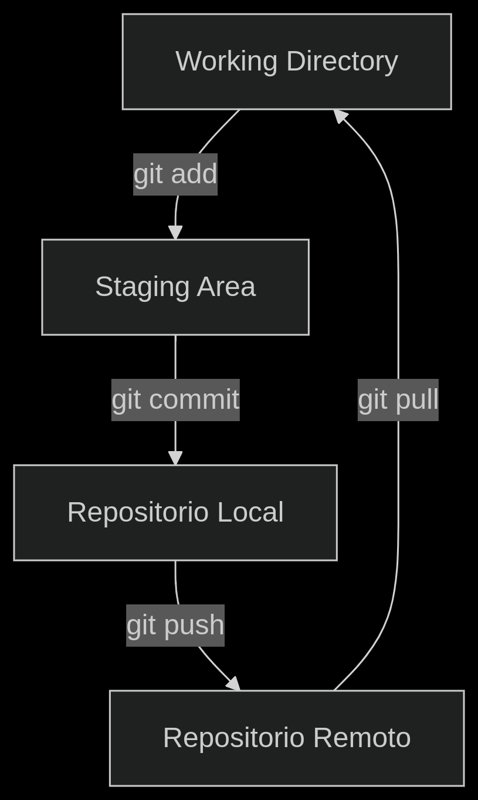
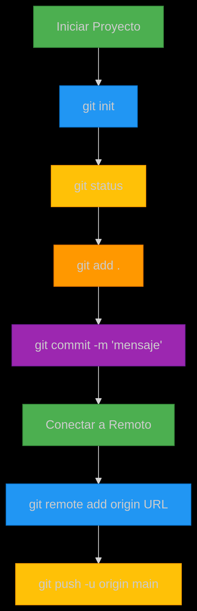

**INTRODUCCION A GIT**

   **-¿Qué es un Control de Versiones?**
   El Control de Versiones (VCS) es crucial en desarrollo de software. Registra y gestiona cambios en el código fuente, permitiendo rastrear modificaciones, comparar versiones, revertir errores y colaborar sin conflictos. Es un "historial inteligente" del código.
   ¿Por qué es importante?

       1.Historial completo de cambios

        Registra qué archivos se modificaron, quién los editó y cuándo se hizo.

        Ejemplo: Con git log, puedes ver toda la evolución de un proyecto.

       2.Recuperación de versiones      anteriores

        Si un cambio introduce un error, puedes volver a una versión estable con un solo comando.

       Ejemplo en Git:

        git checkout <commit-hash>  # Restaura el proyecto a un estado   anterior

       3.Trabajo en equipo sin conflictos

        Permite que varias personas trabajen en el mismo proyecto sin sobrescribir cambios.

        Herramientas como Git y GitHub facilitan la fusión de código (merge).

       4.Desarrollo en ramas paralelas (branches)

        Puedes experimentar con nuevas funciones en una rama separada sin afectar el código principal.

       Ejemplo:

        git branch nueva-funcion  # Crea una rama nueva
        git checkout nueva-funcion  # Cambia a esa rama

        
 

  **-Fundamentos de Git**  
       
      1. Repositorios: 
        ¿Qué es? Una carpeta especial donde Git guarda todas las versiones de tu proyecto.

      Tipos: 

       Local: Solo está en tu compu (la carpeta .git).

       Remoto: Vive en internet (GitHub, GitLab, etc.).

      Comandos útiles:

       git init          # Convierte tu carpeta en un repo  
       git clone [url]   # Descarga un repo remoto  

      2. Cómo Subir Cambios 

       Prepara los archivos:

        git add .       # Agrega TODOS los cambios  
        # o  
        git add [archivo]  # Agrega solo uno  

       Guarda una "foto":

        git commit -m "Mensaje corto y claro"  

       Mándalo a la nube:

        git push        # Sube todo al remoto  

       3. Ramas: Tu Espacio de Pruebas
       Para qué sirven: Para experimentar sin romper el proyecto principal.

       Cómo usarlas:

        git branch [nombre-rama]    # Crea una rama nueva  
        git checkout [nombre-rama]  # Cámbiate a ella  
        # Versión rápida:  
        git checkout -b [nombre-rama]  # Crea y cambia  

       Fusionar ramas:

        git checkout main         # Vuelve a la rama principal  
        git merge [nombre-rama]  # Combina los cambios   

       4. Trucos que Te Salvarán la Vida
       
       Ver qué cambió:

        git status       # Muestra archivos modificados  
        git diff         # Muestra los cambios exactos  

       Deshacer un error:

        git restore [archivo]  # Descarta cambios no guardados  

       Actualizar tu repo local:

        git pull   # Trae cambios del remoto  

       5. Grafico de funcionamiento

  **Configurar Nombre Y Correo** 

     ¿Para qué sirve?
      Para que Git sepa quién hace cada cambio (aparecerá en los commits).

       Comandos Clave:

        # Configura nombre (usa el mismo que en GitHub/GitLab)
        git config --global user.name "Tu Nombre"

        # Configura email (usar el mismo de tu cuenta Git)
        git config --global user.email "tu@email.com"
      

  **Configurar editor de código que abre Git**   
      
       Por defecto, Git usa:

        -Vim en sistemas Unix/Linux

        -Nano en algunas distribuciones

        -Notepad en Windows

       Asignar editor 

        git config --global core.editor "code --wait" 
 
  **Comprobar configuracion de Git**

      1. Ver TODA la configuración

        git config --list

      2. Ver un valor específico

       # Ejemplo: ver tu nombre de usuario

        git config user.name

       # Ver tu editor configurado

        git config core.editor

      3. Ver configuración global (de tu usuario)

        git config --global --list

      4. Ver configuración local (solo del repositorio actual)

        git config --local --list
       
       Tip: Usa --show-origin para ver DE DÓNDE viene cada configuración:

        git config --list --show-origin

  **¿Cómo inicializar un nuevo proyecto Git?**

      1. Navega a tu carpeta del proyecto
     
        cd /ruta/de/tu/proyecto

      2. Inicializa repositorio Git

        git init

      3. Verifica el estado

        git status

 