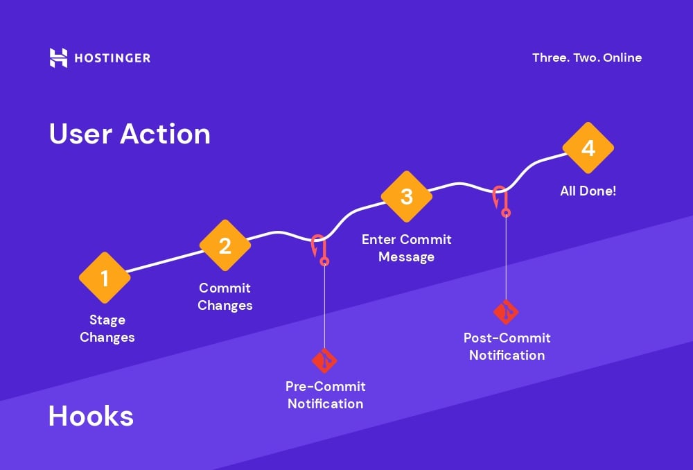

**HOOKS, ALIAS Y TRUCOS**

  *¿Qué es un Hook?*

     Un hook es un 
     script automatizado que se ejecuta 
     cuando ocurre un evento específico en 
     Git (ej: antes de un commit, después 
     de un push, etc.).

    Tipos de Hooks

     1. Hooks del Lado Cliente (Locales)

         pre-commit: Se ejecuta antes de confirmar un commit.

         Uso típico: Validar sintaxis del código o ejecutar tests.

         commit-msg: Verifica el formato del mensaje del commit.

         post-merge: Corre después de un git merge.

     2. Hooks del Lado Servidor (Remotos)

         pre-receive: Valida cambios antes de aceptarlos en el repo remoto.

         post-receive: Ejecuta acciones después de un push (ej: desplegar código).

    Usos Comunes

       Tests automáticos antes de commitear (pre-commit).

       Notificaciones (ej: enviar un mensaje a Slack tras un push).

       Prevención de commits inválidos (mensajes mal formados, código sin formato).

    Limitaciones

       No se versionan: Los hooks no se guardan en el repo por defecto (usa husky en Node.js para compartirlos).

       Soportan cualquier lenguaje (Bash, Python, Ruby, etc.).

       
