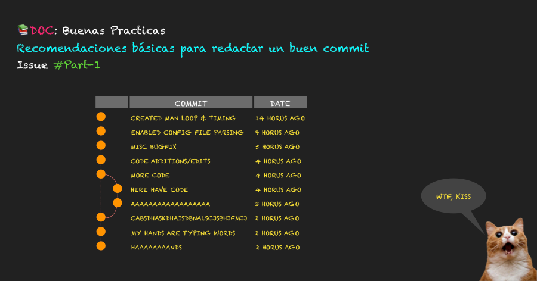
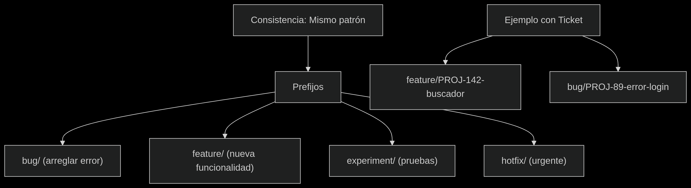

**BUENAS PRACTICAS EN GIT**
 *¿Cada cuánto debería hacer un commit?*
   
    Hacer commits pequeños y frecuentes, dividiendo los cambios en unidades lógicas y significativas.

   Características de un buen commit
  
     Atomicidad: Cada commit debe contener un único cambio o mejora completa (no mezclar funcionalidades distintas).

     Frecuencia: Graba progresos seguido, no esperes a terminar toda la tarea.
     
     Significado: El commit debe representar un avance concreto (aunque sea pequeño).

     Qué evitar

     Megacommits (ej: "Subo todo el proyecto").
     
     Commits sin sentido (ej: "Avances", "Cambios").
 
     Romper el código: Asegurarse de que el proyecto sigue funcionando tras cada commit.

*Escribir buenos commits*

 1. Estructura del Mensaje

    <tipo>(<ámbito>): <mensaje breve>  ← Máx. 50 caracteres
    <BLANK LINE>
    <cuerpo detallado>  ← Opcional (explica el "qué" y "por qué")

  2. Tipos de Commits (Prefixes)
   
   ┌─────────┬───────────────────────┬─────────────────────────────┐
   │ Prefijo │ Uso                   │ Ejemplo                     │
   ├─────────┼───────────────────────┼─────────────────────────────┤
   │ feat    │ Nueva funcionalidad   │ feat(search): add filter    │
   ├─────────┼───────────────────────┼─────────────────────────────┤
   │ fix     │ Corrección de bug     │ fix(login): validate email  │
   ├─────────┼───────────────────────┼─────────────────────────────┤
   │ docs    │ Documentación         │ docs: update API examples   │
   ├─────────┼───────────────────────┼─────────────────────────────┤
   │ style   │ Formato (sin lógica)  │ style: fix indentation      │
   └─────────┴───────────────────────┴─────────────────────────────┘

  3. Reglas de Oro

   -Verbos en imperativo (Add, Fix, Remove, Change).

   -Sin puntos finales → fix: update header (error) fix: update header.

   -Ámbito opcional (paquete/archivo afectado): feat(api): add endpoint.
 
  *Pasos para un buen commit*
   
   1.Diseño:

   Título largo: "mi primer commit del tema ####".

   2.Flujo lateral:

   Checklist (✔️ Verbo imperativo / ✔️ 50 caracteres / ✔️ Prefijo).

   3.Pie de imagen:
    
    "Un historial de commits claro = Menos estrés en code reviews".

  Como extra se adjunta el siguiente enlace que explica de manera mas derecta 
  como crear un buen commit.

  https://www.linkedin.com/posts/midudev_7-reglas-para-escribir-buenos-mensajes-de-activity-7270088739480109056-yc3I?utm_source=share&utm_medium=member_desktop&rcm=ACoAAFi5KQ4Bsk5ZVKPUuPQM_RKL6gWZEAel7U4

  *Escribir un buen nombre de rama*

  Los pasos son los siguientes:

   1. Consistencia

     -Usar siempre el mismo patrón en el equipo.

     -Documentar las reglas acordadas.

   2. Prefijos Según Acción
     
     Tipo	      Uso
     
     bug	      Arreglar un bug conocido.

     feature	  Desarrollar una nueva funcionalidad.

     experiment	Pruebas que no se fusionarán.
     
     hotfix    	Solución rápida para errores críticos.

    3. Incluir ID de Ticket

     Ejemplo: PROJ-123-feature-buscador.

     Aplicable si se usa JIRA u otro sistema de tickets.

  

  

