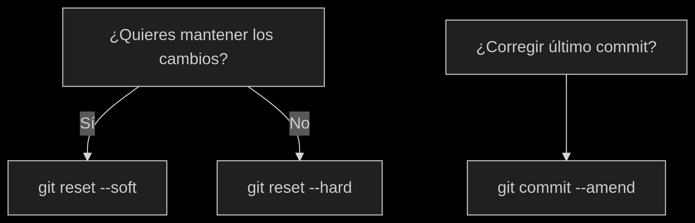

**¿Cómo deshacer mis cambios?**

   1. Deshacer el Último Commit 
  
    git reset --soft HEAD~1

     -Qué hace: Elimina el último commit pero mantiene los cambios en el área de staging.

     -Cuándo usarlo: Si quieres rehacer el commit con nuevos ajustes.

   2. Deshacer el Último Commit (y Perder los Cambios)

       git reset --hard HEAD~1

     -Qué hace: Elimina el último commit y todos los cambios (¡Cuidado! Esto es destructivo).

     -Cuándo usarlo: Si quieres descartar completamente los últimos cambios.

   3. Corregir el Último Commit (Sin Crear Uno Nuevo)

       git commit --amend

     -Qué hace:

        *Modifica el mensaje del último commit.

        *Añade cambios nuevos al último commit (si hay archivos en staging).

   ¿Cuándo Usar Cada Opción?

     Quieres reescribir el commit:	git reset --soft HEAD~1

     Quieres eliminar todo el cambio:	git reset --hard HEAD~1

     Olvidaste algo en el último: commit	git commit --amend

   Advertencias
 
     --hard es peligroso: Borra cambios permanentemente.

     --amend + push --force: Solo para commits no compartidos. Si ya hiciste push, avisa a tu equipo.

