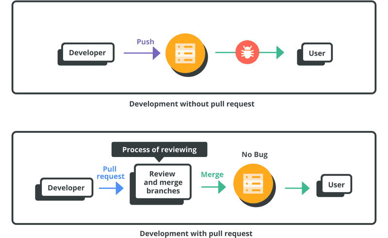
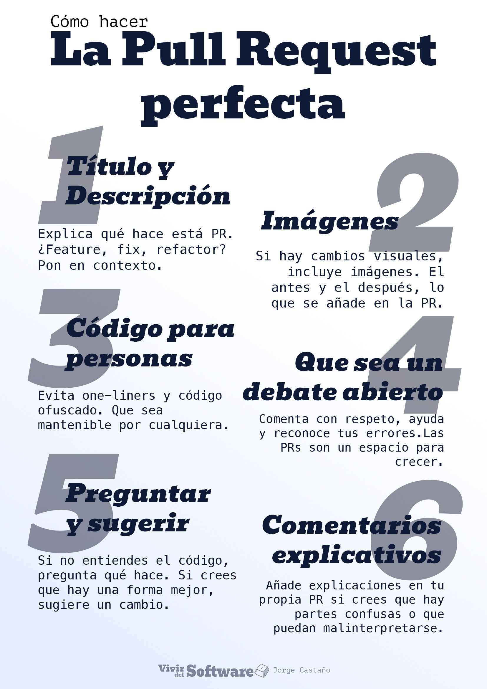

**PUSH, PULL Y PULL REQUEST**

  **¿Cómo hago Pull Request?**
    
    -Haz cambios en una rama de tu fork.

    -Haz push de esa rama a tu repositorio remoto (GitHub).

    -GitHub mostrará una URL para crear el Pull Request (PR).

    -Abre el enlace y verifica:

      *Repositorio y rama de origen (tu fork).

      *Repositorio y rama de destino (original).

      *Cambios a enviar.

      *Título y descripción del PR.

    -Haz clic en "Create Pull Request".

  

   
  **Marcar tu Pull Request como Borrador (Draft)**

   Al crear un Pull Request en GitHub, puedes marcarlo como Draft (borrador). Esto:

     Muestra tus cambios, pero

     Indica que aún no están listos para fusionar.

     Permite recibir comentarios y revisiones sin presión.

   Se usa el modo Draft para compartir avances sin terminar y dejar claro que no se deben fusionar todavía.

  **Hacer una buena Pull Request**

  Cómo hacer una buena Pull Request (resumen corto y claro):

  1.Lee el CONTRIBUTING.md:
   
    Sigue las reglas del repositorio si existen.

  2.Respeta el estilo del código:

    No hagas cambios innecesarios como formato o comillas.

  3.Haz una cosa a la vez:

    Céntrate en un solo cambio por PR. Es más fácil de revisar.

  4.Explica bien tu PR:

    Usa texto claro, y si puedes, agrega imágenes, GIFs o videos para mostrar lo que hiciste

  

  **Revisar una Pull Request**  

   1.Practica la empatía y respeta el tiempo ajeno
   Agradece el esfuerzo de quien hizo la contribución. Una revisión empática mejora el ambiente del equipo y favorece el aprendizaje mutuo.

   2.Ofrece retroalimentación constructiva
   Señala los aspectos positivos y sugiere mejoras de manera clara, amable y orientada al crecimiento. El objetivo no es solo corregir, sino ayudar.

   3.Sé claro, directo y específico
   Evita comentarios vagos o ambiguos. Expón tus observaciones con ejemplos concretos para que puedan ser comprendidas y aplicadas fácilmente.

   4.Propón soluciones cuando sea posible
   Usa las herramientas de sugerencias de código de GitHub para ofrecer alternativas prácticas que agilicen el proceso de mejora.

   5.Ten en cuenta el contexto
   Evalúa si los cambios cumplen su propósito, aunque el código no sea perfecto. A veces, soluciones temporales o parciales son necesarias.

   6.Incluye un archivo CONTRIBUTING.md
   Este documento en la raíz del repositorio puede guiar a los colaboradores sobre cómo contribuir, revisar y mantener la coherencia del proyecto.
