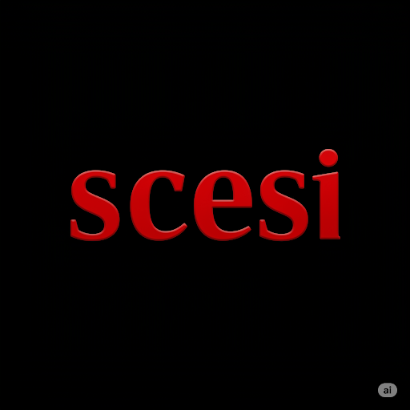

Este trabajo práctico individual surge de los apuntes que tomé en un curso de Git,
específicamente enfocado en las herramientas y flujos de trabajo relevantes para mi
postulación a la Sociedad Científica de Estudiantes de Sistemas e Informática (SCESI).
Durante el curso, cubrimos desde los principios básicos del control de versiones hasta
la gestión de ramas y la colaboración remota.

### 📚 Tabla de Contenidos

Estos apuntes están organizados por temas, cada uno en su propia rama:

 1.[1. Introducción](https://github.com/2CONDE2/Apuntes-Git/tree/1.Introduccion)
 
 2.[2. States y Commits](https://github.com/2CONDE2/Apuntes-Git/tree/2.States_y_Commits)
 
 3.[3. Ramas, Merge y Conflictos](https://github.com/2CONDE2/Apuntes-Git/tree/3.Ramas_Merge_Y_Conflictos)
 
 4.[4. GitHub](https://github.com/2CONDE2/Apuntes-Git/tree/4.GitHub)
 
 5.[5. Push, Pull y Pull Request](https://github.com/2CONDE2/Apuntes-Git/tree/5.Push_Pull_y_Pullrequest)
 
 6.[6. Gitflow](https://github.com/2CONDE2/Apuntes-Git/tree/6.Gitflow)
 
 7.[7. Buenas Prácticas](https://github.com/2CONDE2/Apuntes-Git/tree/7.Buenas_Practicas)
 
 8.[8. Deshacer Cambios](https://github.com/2CONDE2/Apuntes-Git/tree/8.Deshacer_Cambios)
 
 9.[9. Hook, Alias y Trucos](https://github.com/2CONDE2/Apuntes-Git/tree/9.Hook_Alias_y_Trucos)
