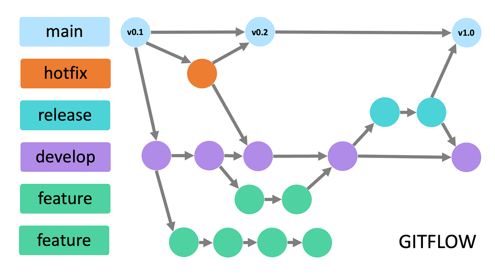
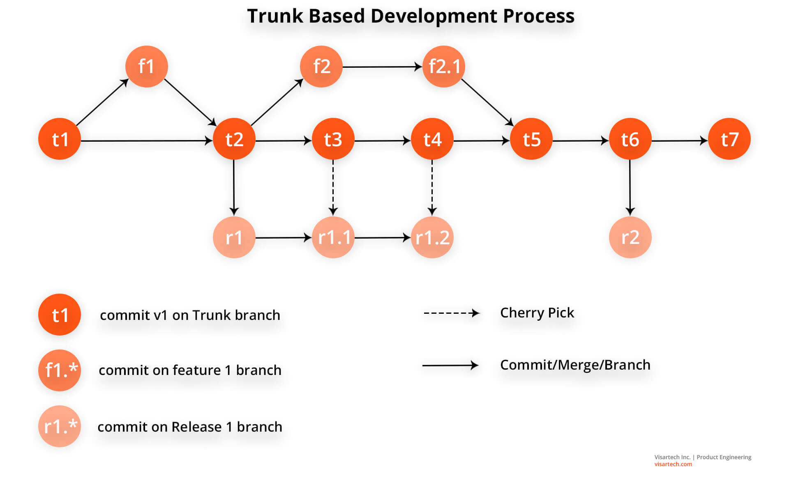

 **Git Flow**

   Ramas Principales

     -main/master: Contiene el código en producción (estable).

     -develop: Código en pre-producción, con nuevas características pendientes de validación para el próximo release.

   Ramas de Apoyo

     *feature-*

      -Origen: develop

      -Destino: Se fusiona en develop (usar --no-ff para mantener historial claro).

      -Uso: Desarrollo de nuevas funcionalidades.

     *release-*

       -Origen: develop

       -Destino: Se fusiona en develop y main (para producción).

       -Uso: Preparación de una nueva versión (puede incluir últimos ajustes).
   
     *hotfix-<version>

       -Origen: main (corrección sobre producción).

       -Destino: Se fusiona en main y develop (o release si existe).

       -Uso: Solución rápida de bugs en producción.

 Se trata evitar:

     *--no-ff en merges: Evita fast-forward para mantener traza de cambios en el historial.

     *Hotfix vs Release:

        *Si hay una rama release abierta, aplicar el parche allí en lugar de en develop.

     *Nomenclatura: Usar prefijos (feature-, release-, hotfix-).

 **GitHub Flow**

 -Estrategia creada por GitHub para proyectos con despliegues frecuentes.

 -Basado en Pull Requests (PRs) y revisión colaborativa antes de integrar cambios.

 *Ramas

  main:

    Rama principal (siempre estable y lista para desplegar).

    Contiene los cambios más recientes validados.

  Otras ramas (ej: feature-*, fix-*):

    Se crean para desarrollar nuevas funcionalidades o correcciones.

    Se fusionan en main mediante PRs.
 
 *Flujo de Trabajo

  1.Crear rama desde main para cambios.

  2.Subir cambios al remoto y abrir un Pull Request.

  3.Revisión colaborativa:

    -Discusión sobre los cambios.

    -Posibles ajustes antes de aprobar.

  4.Integración Continua (CI):

    -Pruebas automáticas (tests, estándares de código).

    -Despliegue en entorno de prueba (opcional).

  5.Aprobación y Merge:

    -Un mantenedor con permisos aprueba o el botón se activa tras pasar CI.

    -Se fusiona en main y se despliega.

  

 **Trunk Based Development**

  -Desarrollo en una sola rama (main/trunk)

  -Minimizar ramas auxiliares (solo para cambios puntuales, vida corta)

  -Commits pequeños y frecuentes

    *Cómo funciona

      -Trabajo directo en main (o ramas efímeras <24h)

      -Integración continua (CI/CD) obligatoria:

         Tests automáticos

         Linters

         Despliegue automático

      -Rollback automático si falla en producción

    Cuándo usar

      -Equipos experimentados

      -CI/CD robusto

      -Cultura de colaboración (pair programming)

    Cuándo evitar

      -Sin automatización de tests

      -Equipos sin disciplina de commits pequeños

      -Proyectos con releases muy espaciados

    Beneficios clave

      -0 merge conflicts

      -Feedback inmediato

      -Producción siempre actualizable

 

 **Ship / Show / Ask**

   Clasificación de Cambios

    1.Ship (Fusionar Directamente)

     -Se integra a main sin revisión

     -Casos de uso:

       *Implementación de patrones establecidos

       *Corrección simple de bugs

       *Actualización de documentación

       *Mejoras por feedback del equipo

       *Adición de nuevos tests

    2.Show (PR Automático)

     -Se crea Pull Request pero:

       *No espera revisión manual
 
       *Requiere pasar CI automático

       *Se fusiona inmediatamente si pasa tests

     -Discusión ocurre post-merge

     -Casos típicos:

       *Soluciones de bugs con registro

       *Refactors menores

       *Features con estructura conocida

       *Cambios con cobertura de tests

    3.Ask (PR con Revisión)

     -Pull Request con aprobación requerida

     -Para situaciones con incertidumbre:

       *Implementaciones complejas

       *Soluciones dudosas

       *Cambios que generan dudas

     -Debe mantenerse breve (horas/días)

 Requisitos Fundamentales

    Infraestructura CI/CD

     -Sistema confiable y rápido

     -Pruebas automatizadas robustas

     -Capacidad de prevenir errores

    Cultura de Equipo

     -Prácticas colaborativas:

        Pair programming

        Mob programming

     -Responsabilidad individual

     -Confianza mutua

     -Manejo del ego

    Normas de Desarrollo

     -Ramas de vida corta

     -Cambios pequeños

     -Merge frecuente

     -Uso de feature flags

  Beneficios Clave

     -Empoderamiento: Autonomía para decidir enfoque

     -Eficiencia: Minimiza tiempos de espera

     -Adaptabilidad: Escalable según complejidad

     -Transparencia: Comunicación clara de cambio

 

 