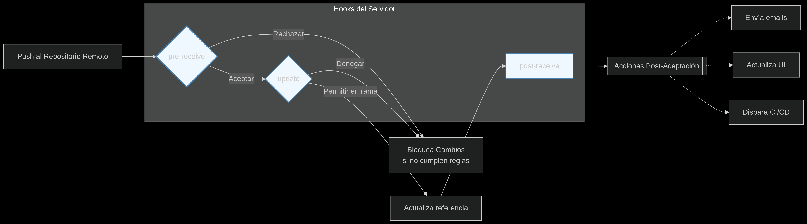

**HOOKS, ALIAS Y TRUCOS**

  *¿Qué es un Hook?*

     Un hook es un 
     script automatizado que se ejecuta 
     cuando ocurre un evento específico en 
     Git (ej: antes de un commit, después 
     de un push, etc.).

    Tipos de Hooks

     1. Hooks del Lado Cliente (Locales)

         pre-commit: Se ejecuta antes de confirmar un commit.

         Uso típico: Validar sintaxis del código o ejecutar tests.

         commit-msg: Verifica el formato del mensaje del commit.

         post-merge: Corre después de un git merge.

     2. Hooks del Lado Servidor (Remotos)

         pre-receive: Valida cambios antes de aceptarlos en el repo remoto.

         post-receive: Ejecuta acciones después de un push (ej: desplegar código).

    Usos Comunes

       Tests automáticos antes de commitear (pre-commit).

       Notificaciones (ej: enviar un mensaje a Slack tras un push).

       Prevención de commits inválidos (mensajes mal formados, código sin formato).

    Limitaciones

       No se versionan: Los hooks no se guardan en el repo por defecto (usa husky en Node.js para compartirlos).

       Soportan cualquier lenguaje (Bash, Python, Ruby, etc.).

       

  *Hooks del lado del cliente (Repositorio local)*

     Los hooks son scripts automáticos que se ejecutan cuando ocurren eventos específicos en Git (como hacer commit o push). Solo afectan al repositorio local donde están instalados y no se comparten automáticamente al clonar un proyecto.

     Hooks más útiles:

      pre-commit:

         Ideal para validar código (ejecutar linters) o verificar cambios antes de confirmar.

      commit-msg:

         Perfecto para forzar convenciones en mensajes de commit (como Conventional Commits).

      pre-push:

         Ejecuta tests completos para evitar subir código roto al repositorio remoto.

      post-merge/post-checkout:

         Útiles para limpieza automática (ej: actualizar dependencias al cambiar de rama).

      Limitaciones:

         No se sincronizan por defecto: Cada desarrollador debe configurarlos manualmente.

         El usuario puede omitirlos con --no-verify (no son obligatorios).

  *Hooks del lado del servidor*

     Scripts automáticos que se ejecutan en el repositorio remoto (GitHub, GitLab, etc.) al 
     recibir cambios.

    3 Hooks principales

       1.pre-receive:

          Valida cambios antes de aceptarlos.

          Ejemplo: Rechazar commits sin mensaje o de usuarios sin permisos.

       2.update:

         Controla cambios por rama o tag.

         Ejemplo: Permitir solo pushes a main desde CI/CD.

       3.post-receive:

         Notificaciones tras aceptar cambios.

         Ejemplo: Enviar emails o activar despliegues.

 

  *¿Cómo puedo crear mi propio hook?*

     -Crear archivo con nombre del hook (ej: pre-commit).

     -Escribir código en cualquier lenguaje (Bash, Python, etc.).

     -Dar permisos: chmod +x .git/hooks/nombre-del-hook.

  *¿Cómo le indico a Git que deje de hacer el seguimiento de un archivo (o varios archivos)?*

    Para un archivo/directorio (sin borrarlo de tu computadora):

     git rm --cached archivo.txt

       Qué hace: Lo elimina del repositorio pero lo mantiene en tu sistema.

    Si está en .gitignore pero Git ya lo trackea:

     git rm -r --cached .
     
     git add .
     
     git commit -m "Stop tracking ignored files"

    Para múltiples archivos (ej: .log):

     git rm --cached *.log

    Nota clave:

     Usa siempre --cached si no quieres borrar el archivo de tu disco.

**BUENO CON ESO CONCLUIMOS LOS APUNTES DEL CURSO DE GIT**
