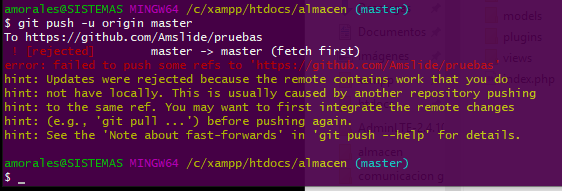

 **GITHUB**

   **¿Git y GitHub son lo mismo?**

    No, Git y GitHub no son lo mismo, aunque están muy relacionados.

     -Git es un sistema de control de versiones. Te permite llevar un registro de los cambios en tus archivos y trabajar en equipo sin perder el historial del proyecto. Funciona localmente, desde tu computadora.

     -GitHub es una plataforma en línea que usa Git y permite guardar tus proyectos en la nube, colaborar con otros y mostrar tu trabajo. Es como una red social para desarrolladores, basada en Git.

     

  **Repisitorios Remotos**

  
    Son copias de tu proyecto guardadas en la nube (como en GitHub). Permiten compartir,
    colaborar y sincronizar cambios con tu repositorio local usando Git.

    

  **Clonando un repositorio remoto**

 Con HTTPS:

   git clone https://github.com/usuario/repositorio.git

    -Más simple, ideal para comenzar.

    -Pide usuario y contraseña o token.

 Con SSH:

   git clone git@github.com:usuario/repositorio.git

    -Requiere una llave SSH configurada.

    -Más seguro y no pide contraseña cada vez.

**¿Cómo enlazar un repositorio local con un repositorio remoto?**

  Usa el comando:

   git remote add <alias> <URL-del-repositorio>
 
  Ejemplo:

   git remote add origin https://github.com/usuario/repositorio.git

    -<alias> suele ser origin (nombre por defecto).

    -Esto le dice a Git que ese es el repositorio remoto con el que trabajará.

  **Escribiendo en el repositorio remoto**

    para enviar tus cambios del repositorio local al remoto, se usa:

     git push <alias> <rama>

    Ejemplo:

     git push origin main

      -origin es el alias del remoto.

      -main es la rama que estás enviando.

  **¡No me deja hacer push! Me dice que ha sido rechazado**

     Esto ocurre cuando el repositorio remoto tiene cambios que tu repositorio local no tiene. Git lo bloquea para evitar sobrescribir el trabajo de otros.

     Razones comunes:

      -Alguien más hizo commits al remoto.

      -Se modificó el historial (ej: con git rebase o git push --force).

      -Tu rama local está desactualizada.

      

 **Creando una rama remota**

   Primero crea la rama localmente:

     git switch -c nueva-rama

   Luego súbela al remoto:

     git push origin nueva-rama