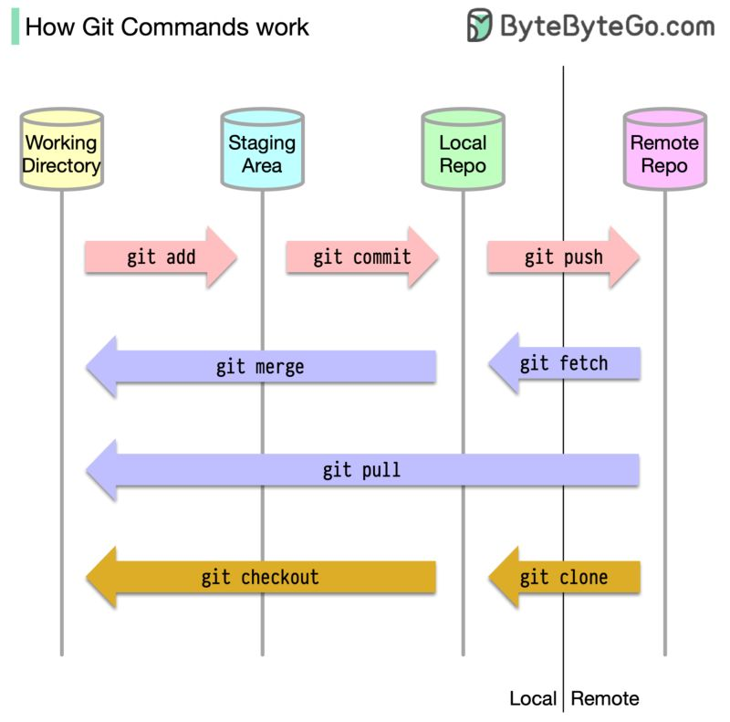
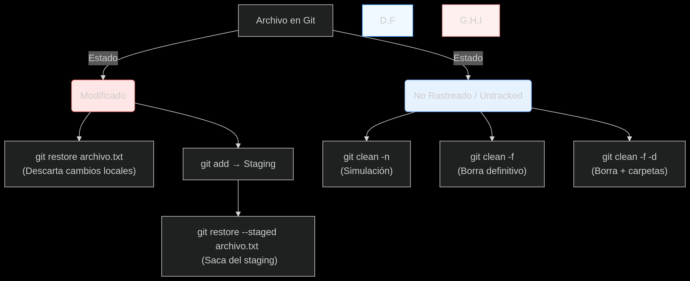
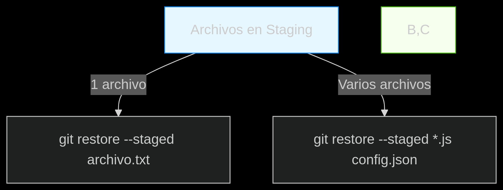

**STATES Y COMMITS**

   **-Los 3 Estados de Git**

     1. Modificado 
      
       Los archivos han sido cambiados en tu directorio de trabajo, pero Git aún no los registra.

         Ejemplo: Editas archivo.txt pero no has usado git add.

     2. Preparado 
       
       Los cambios han sido marcados para ser incluidos en el próximo commit con git add.

         Ejemplo: git add archivo.txt lo mueve al staging area.

     3. Confirmado 

       Los cambios ya están guardados permanentemente en el repositorio de Git con git commit.

         Ejemplo: git commit -m "Mensaje" guarda una versión en el historial.

   **-Como Deshacer un Archivo modificado**
     
      Si aún no has hecho git add (el archivo está en Working Directory):

         git restore archivo.txt     # Descarta los cambios locales (vuelve al último commit)

      Para hacer una limpieza de archivos no rastreados
       Usas el comando; 

             git clean -f      # Elimina archivos no rastreados (requiere fuerza -f)
             git clean -f -d   # Elimina archivos + directorios no rastreados
             git clean -n      → Simulación (ver qué se borraría) 

   **¿Como añadimos archivos al area de staging?**
     
     1. Añadir archivos específicos

        git add nombre_archivo.txt    # Añade un archivo en concreto
        git add *.js                 # Añade todos los archivos .js

     2. Añadir todos los archivos modificados/untracked

        git add .                    # Añade todo (archivos modificados + nuevos)
        git add -A                   # Añade todo (incluyendo eliminaciones)

     3. Añadir partes de un archivo (interactivo)

        git add -p   

   **¿¿Cómo puedo sacar uno o varios archivos del área de staging??**   

     1. Sacar UN archivo

        git restore --staged archivo.txt  

     2. Sacar VARIOS archivos

        git restore --staged *.js        # Todos los .js del staging
 
     Una recomendacion es que antes de sacar un archivo hacer un git status para verificar qué archivos están en staging antes de actuar.

     

   **¿Que es un Commit?**

     Un commit es un guardado permanente de los cambios que preparaste en el staging area. Es como una "foto" de tu proyecto en un momento específico.

         git commit -m "Mensaje descriptivo"  
      
      (Primero debes usar git add para preparar los cambios)

    Datos clave

     Irreversible: Los commits no se borran (solo se pueden "deshacer" con otros comandos).

     Historial: Git guarda todos los commits en orden cronológico.

     Seguridad: Cada commit tiene un hash que evita modificaciones fraudulentas.

   **¿Qué es el HEAD?**

     HEAD es un apuntador que indica:

      -Dónde estás en el historial (commit actual).

      -En qué rama estás trabajando

     Tener en cuenta:

      -No es un commit: Es una referencia al último commit de tu rama actual.

      -Se mueve automáticamente al hacer commits o cambiar de rama.

      -Símbolo común: HEAD -> main (en git log)

           
