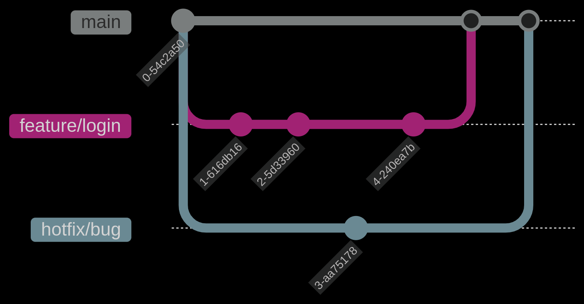
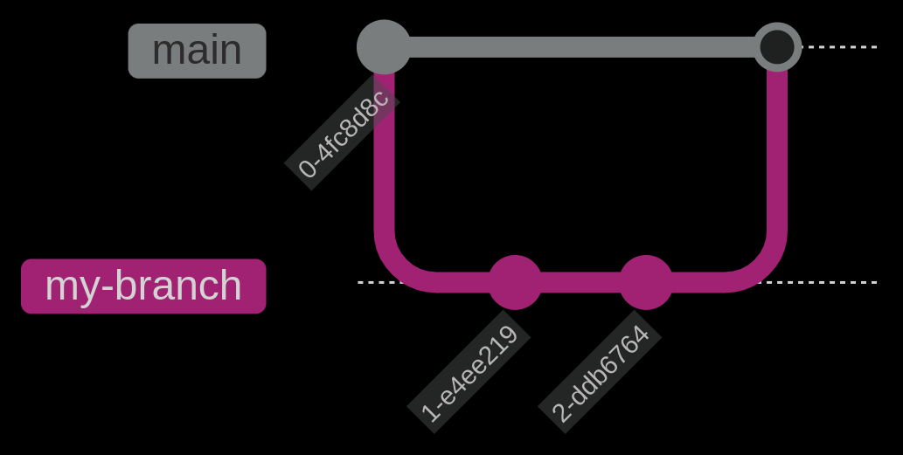

**RAMAS, MERGE Y CONFLICTOS**

   **¿Que es una rama y para que sirve?**

   Qué es:

     -Versión independiente de los archivos/directorios del repositorio.

     -Al crearla, se copia el estado actual del código.

   Para qué sirve:

     -Permite trabajo en paralelo (ej: una persona añade funcionalidades, otra corrige bugs, otra documenta).

     -Aísla cambios individuales sin afectar el código base.

   Flujo básico:

     -Todos parten del mismo código (rama principal, ej: main).

     -Cada colaborador crea su rama para trabajar.

     -Al terminar, integran sus cambios a la rama principal ("tronco").

   Ventaja clave:

     -Evolución ordenada del proyecto sin conflictos inmediatos.

 **Trabjar con Ramas**
    
   Propósito:

     -Permite desarrollo paralelo sobre la misma base de código.

     -Cada rama es una línea de desarrollo independiente.

   Creación de ramas:

     -Debate sobre git checkout (cambia de rama *y* restaura el directorio de trabajo):

     -Criticado por no seguir la filosofía Unix ("un programa, una función").

   Alternativa mencionada:
   
    -git switch 

   Comandos para listar ramas:

    -git branch → Ramas locales.

    -git branch --show-current → Rama actual.

    -git branch --sort=-committerdate → Ordena por fecha de commit

 **Fusionar Ramas**

   Destino de las ramas
      
    -Olvido: Ramas no fusionadas (abandonadas).

    -Fusión: Integración de cambios en otra rama.

   Proceso de fusión

    Git merge:

     Comando: git merge <rama-origen>.

   Ejemplo:

    git checkout main          # Cambiarse a la rama destino  

    git merge my-branch       # Fusionar cambios de 'my-branch' en 'main'  

   Resultado: El código de my-branch se incorpora a main.

   

  **Resolver Conflictos**

   Detección de Conflictos

    -Ocurren cuando dos ramas modifican las mismas líneas de un archivo.

    -Git bloquea la fusión y marca los conflictos en el código.

   Opciones para Resolver

    -Conservar cambios de main (rama actual).

    -Conservar cambios de changes (rama entrante).

    -Combinar manualmente ambas versiones.

         rama main       rama cambios
             ●               ●
              \             /
               ●───X (conflicto)
                \
                 ● (commit de fusión)

  **Eliminando Ramas**

    
   ¿Qué significa "podar"?

    -Eliminar ramas locales/remotas que ya no son necesarias (ej: después de merge).

    -Mantener el repositorio organizado y evitar acumulación de ramas inactivas.

    Comandos para Podar Ramas

    # Eliminar rama local (si ya está fusionada)

       git branch -d nombre_rama

    # Forzar eliminación (sin merge)

       git branch -D nombre_rama
      
   Norta:

    -No podar ramas en uso por otros colaboradores.

    -Confirmar merge antes de eliminar.

    -Sincronizar cambios con git fetch --prune regularment

